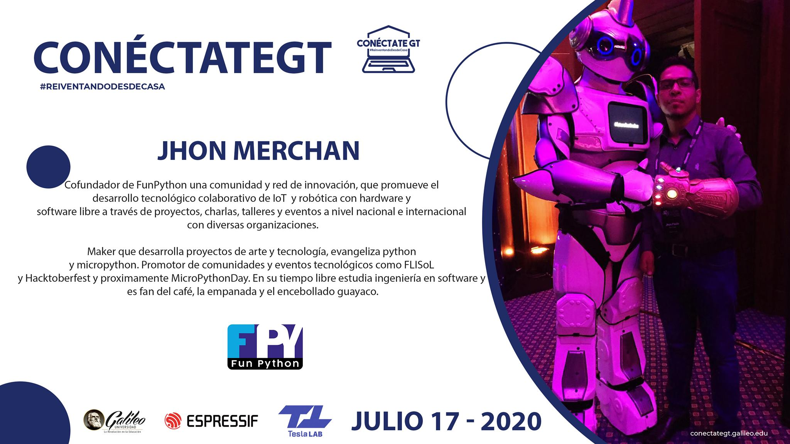
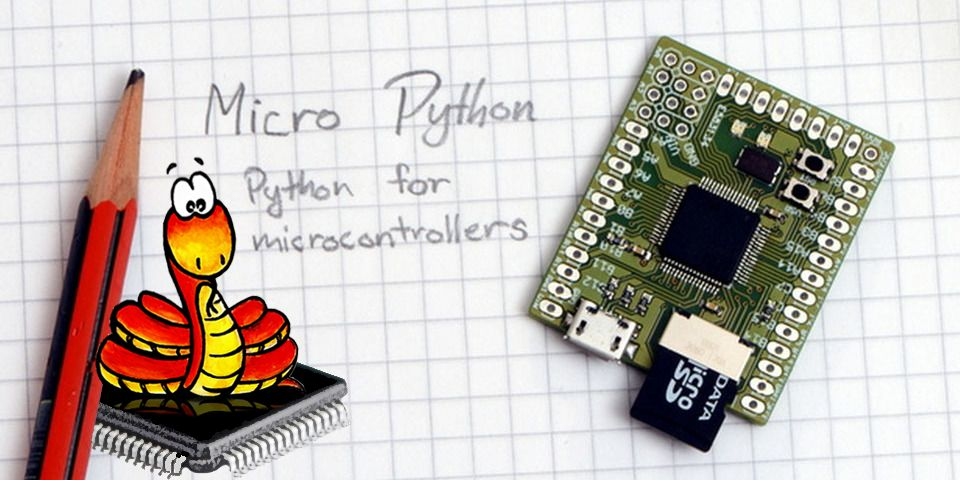
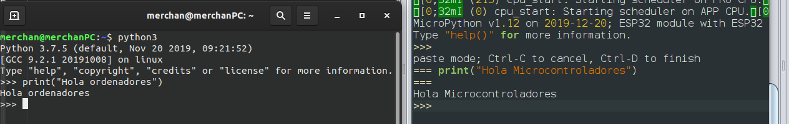
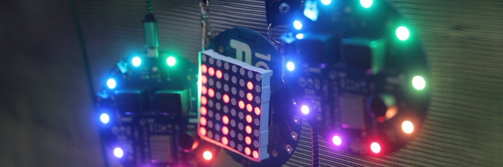
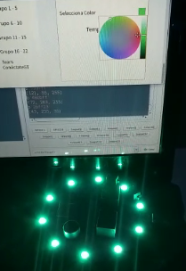

# ConéctateGT - Comunidad FunPython & MicroPythonESP32
[CONÉCTATEGT](http://conectategt.galileo.edu/index.html#) es un evento en línea de un día donde aprenderás los fundamentos de IoT

Reseña del evento [_El intertnet de las cosas ya es el presente_](https://www.galileo.edu/fisicc/historias-de-exito/conectategt-el-internet-de-las-cosas-ya-es-el-presente) 

[Transmición en YouTube ](https://youtu.be/56bGFpmzRbI) 

<p align="center">
  
</p>

## FunPyhton 

FunPython es una comunidad técnologica y red de innovación social que busca unir a mentes creativas mediante el intercambio de ideas, experiencias y colaboraciones.

[Tríptico informativo sobre Funpython](https://github.com/FunPythonEC/ConectateGT/blob/master/media/FunPython_triptico.pdf)

### Jhon Merchan 

<p align="center">
  
</p>

## MicroPython 
 
 

[MicroPython](http://MicroPython.org/) es una implementación ligera de . Creada por el fisico y programador Damien George en 2014 gracias a una exitosa campaña en [Kickstarter](https://www.kickstarter.com/projects/214379695/micro-python-python-for-microcontrollers), junto a la Pyboard, la placa oficial de MicroPython, desde entonces se ha portado a diferentes plataformas.

A nivel de microcontroladores MicroPython es un sistema operativo, que incluye un subconjunto de librerías importantes de python (la librería socket es muy similar a la que usamos en un ordenador) y algunas nativas para controlar proyectos electronicos, ademas de una sheel interactiva, ademas MicroPython permite utilizar código C++ para optimizar su velocidad. MicroPython trata de ser multiplataforma al tener compatiblidad con código Python normal y poder enviar tu código de la computadora al microcontrolador con total tranquilidad.

[Más información sobre python y microcontroladores](https://pythononhardware.funpython.org/) 

_Hola Mundo en Ubuntu 20 vs MicroPython_

 

### Instalar MicroPython

Guía paso a paso con imagenes para instalar MicroPython y sus prerequisitos.

[Tutorial en Windows 10](https://github.com/FunPythonEC/ConectateGT/blob/master/Instalando_MicroPython.md)

### Instalar librerías y uso del sistema de archivos

Guía paso a paso para instalar la librería del sensor de temperatura/humedad/presión en el ESP32 y guía para manipular archivos de la memoria del ESP32 utilizando la terminal o consola. 

[Tutorial para instalar librerías](https://github.com/FunPythonEC/ConectateGT/blob/master/Instalar_librerías.md)

[Tutorial sistema de archivos ESP32](https://github.com/FunPythonEC/ConectateGT/blob/master/sistema_de_archivos.md)

## DEMO

[Ejemplos básicos con MicroPython](https://github.com/FunPythonEC/ConectateGT/blob/master/ejemplos.md)

Cambiar las credenciales de la red WiFI.

```python
# Información de la red WiFi
# Nombre de red y contraseña

WIFI_SSID = 'tuRed'
WIFI_PASSWORD = 'tuContraseña'
```
Cambiar las credenciales para conectar al servidor MQTT.

```python
# Información del servidor MQTT
# Cambiar el número del node#

MQTT_URL = b'galiot.galileo.edu' 
MQTT_USER = b'node' 
MQTT_TOPIC = b'temp'
```

### Subscribirse a la paleta de colores para las luces led rgb

Anillo de leds RGB

NeoPixel ring | ESP32
--------------|------
DIN | 25
VCC | +5V
GND | GND

```python
# cantidad de leds rgb y pin de conexión 
num_leds = 10
pin_salida = 25
```
[demo/subscribe_rgb.py](https://github.com/FunPythonEC/ConectateGT/blob/master/mqtt/subscribe_rgb.py)

[demo/neopixel_arcoiris.py](https://github.com/FunPythonEC/ConectateGT/blob/master/demo/neopixel_arcoiris.py)



### Publicar en el servidor MQTT los valores de temperatura y presión

Sensor de temperatura/humedad

BMP180 | ESP32
-------|------
SCL | 22
SDA | 21
VCC | +3V3
GND | GND

```python
i2c = I2C(scl=Pin(22), sda=Pin(21), freq=10000)
```
[demo/publish_bme280.py](https://github.com/FunPythonEC/ConectateGT/blob/master/demo/publish_bme280.py)

[demo/publish_bmep085.py(beta)](https://github.com/FunPythonEC/ConectateGT/blob/master/demo/publish_bmp085.py)



[Documento en versión Web](https:/conectagt.funpython.org/) [](https://conectagt.funpython.org/)